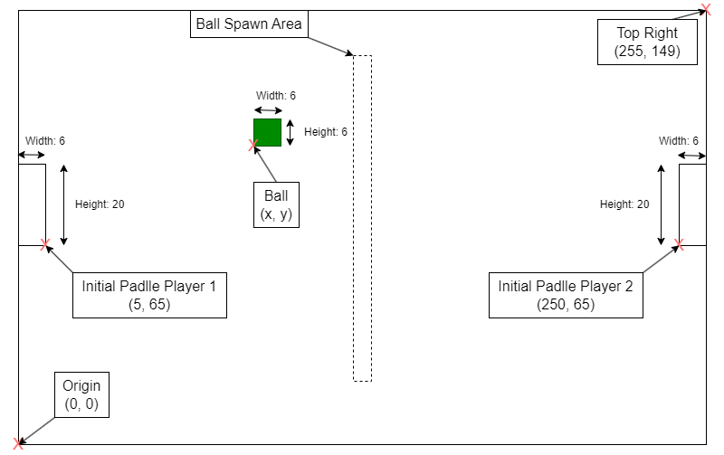
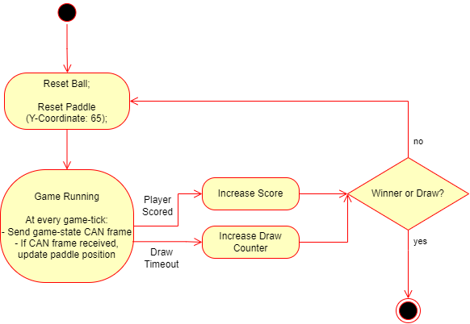

# Hackathon CAN Pong

## Pong field definition

## Paddle reflections

If the ball reflects from a paddle, it doesn't simply reflect with equal but inverse angles. The angle is **only** dependent on the position of the hit on the paddle:

## Game logic

You win if you reach 5 points first.
If 3 draws due to a timeout occur, the player with more points wins. If both still have the same number of points, the whole game is a draw.

## Parameters

### General parameters

These parameters define the general dimensions of the game components.

| Parameter | Value | Additional Information |
| - | - | - |
| Field width | 256 |  |
| Field height | 150 |  |
| Paddle width | 6 | The paddle is a rectangle |
| Paddle height | 20 |  |
| Ball width | 6 | The ball is a square |
| Ball height | 6 |  |

### Player specific parameters

These parameters are related to the specific player.

| Parameter | Value | Additional Information |
| - | - | - |
| Player 1: x-coordinate of bottom **right** of paddle | 5 |  |
| Player 2: x-coordinate of bottom **left** of paddle | 250 |  |
| Initial y-coordinate of **bottom** left of paddle | 65 | This value is only reset once the game is finished. |
| Range of y-coordinate of **bottom** of paddle | 0 to 130 | Never let your paddle get out of range or else it will be out of sync with the servers position of your paddle |
| Paddle update values | -1, 0, 1 | Every frame, the paddle of a player can only be updated by one of these values. |

### CAN messages & setup

#### CAN setup

The CAN library github with examples: [Adafruit_CAN](https://github.com/adafruit/Adafruit_CAN)

The baudrate of the CAN bus is **250000 kbps**.

#### Frames from the game server

This frame is sent by the game server at every game-tick.
It provides the current game state and the position of the ball.

##### Frame
| ID | Byte0 | Byte1 | Byte2 |
| - | - | - | - |
| 0x01 | `uint8_t`: **ball x-coordinate** (bottom left of ball) | `uint8_t`: **ball y-coordinate** (bottom left of ball) | `uint8_t`: **game state** |

###### Possible values for game state

| Value | Description |
| - | - |
| 0 | **Game start.** This is only sent once to indicate the start of a new game. |
| 1 | The game is running. |
| 2 | Player 1 scored a point. The ball will get reset. |
| 3 | Player 2 scored a point. The ball will get reset. |
| 4 | No player scored a point due to timeout. The ball will get reset. |
| 5 | **Game over.** Player 1 won the game (score of 5 reached). The entire game is reset (including the initial paddle positions). |
| 6 | **Game over.** Player 2 won the game (score of 5 reached). The entire game is reset (including the initial paddle positions). |
| 7 | **Game over.** No winner. The entire game is reset (including the initial paddle positions). |

#### Player control frame

Send this frame to update your paddle. The id changes depending on whether you're player 1 or player 2.
**Send this only once every game-tick (after you received an update from the server)**
`If you send this frame multiple times between two frames from the server, only the first one you sent will be read by the server.`
**You are not required to send this every game-tick. If your paddle is already in the correct position there is no need to send a update value of `0`.**

##### Frame
| ID | Byte0 |
| - | - |
| 0x02 / 0x03  (for player 1 / player 2) | `int8_t`: **paddle update** (The value to move the paddle. **Must be either -1, 0 or 1**) |
